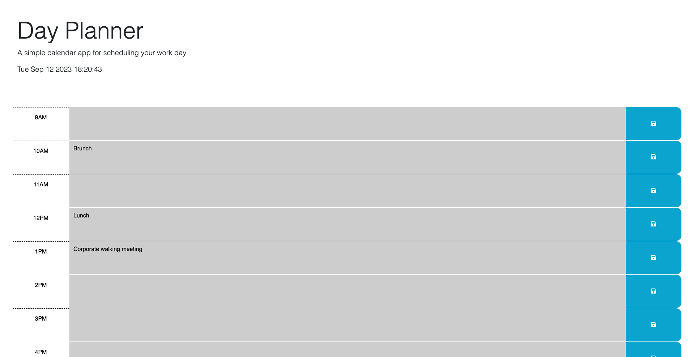

# Day-planner

## Description

This day planner app functions in a way that you can schedule your day in an efficient manner. When you add an activity in a time block and click the save button, it saves the activity to your local storage. Each time block is color coded depending on the actual time. Green is future, Red is present, and gray is past time. When page is refreshed you can see the saved activites. 

## Screenshot of page

## Link to deployed page

https://dylanmayfield.github.io/day-planner/